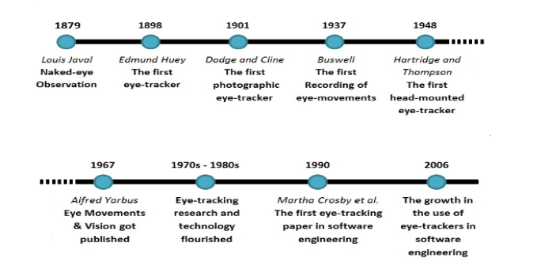
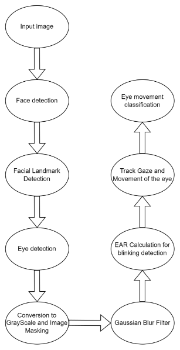

<a name="_qyxep34u6rpm">Dezvoltarea unei soluții de eye-tracking</a>

Eye tracking-ul poate fi descris ca o tehnică de înregistrare a mișcării ochilor și a locației privirii de-a lungul timpului pentru a observa alocarea atenției vizuale. Această tehnică utilizează procesarea imaginilor și (sau) algoritmi de învățare automată pentru a detecta ochii umani și a identifica prezența și mișcarea ochilor unei persoane într-un videoclip în timp real. Un număr tot mai mare de tehnici non-invazive de urmărire a ochilor au fost dezvoltate pentru a înlocui tehnicile mai vechi care necesită contact direct cu corneea ochiului uman. Sistemul accesibil de eye-tracking câștigă popularitate față de sistemele costisitoare și nepractice de eye-tracking care se bazează pe un dispozitiv special de urmărire a privirii.

` `Interesul pentru aplicațiile de detectare a ochilor a crescut considerabil. Foarte multe metode de detectare a ochilor sunt utilizate în diferite aplicații, cum ar fi neuroștiința, psihologia, tehnologiile asistive pentru a comunica cu pacienții cu dizabilități, jocuri pe calculator, tehnologii de monitorizare pentru conducătorii auto împotriva oboselii (în transportul comercial și public), în industria publicității, identificarea persoanei bazat pe recunoașterea feței și detectarea ochilor (iris) și în diferite aplicații militare.

`	`Scurt istoric:

Eye tracking-ul este prima și importantă sarcină a sistemului de urmărire a ochilor.Ea captează ochii unui individ folosind un senzor infraroșu sau o cameră cu scopul de a identifica irisul și de a estima locația pupilei într-o imagine a unui ochi și. După finalizarea detectării ochilor, sarcinile de predicție a stării ochilor și (sau) privirea ochilor sunt apoi implementate pentru a urmări mișcarea ochilor. În general, precizia urmăririi ochilor se referă la contrastul dintre direcția măsurată a privirii și direcția reală a privirii pentru un individ. Rezultatele pot varia de pe ecran, în funcție de condițiile externe, cum ar fi iluminarea, calitatea senzorului și caracteristicile individuale ale ochiului, de exemplu forma ochiului.

**Pașii de dezvoltare pentru algoritmul de eye tracking:**

Proiectul nostru are ca scop dezvoltarea unei soluții de eye-tracking care să fie capabilă să detecteze și să urmărească, în timp real, direcția privirii unei persoane. Vom folosi tehnici avansate de prelucrare a imaginilor pentru a identifica poziția ochilor și a urmări mișcările acestora, bazându-ne pe imaginile capturate de o cameră video.

Pentru a atinge acest obiectiv principal, ne-am propus să realizăm următoarele scopuri specifice:

1. Sistem de detectare a feței și ochilor: Vom implementa algoritmi de recunoaștere facială care să ne permită delimitarea zonei ochilor și localizarea precisă a pupilelor. Aceasta este o etapă esențială pentru a putea continua cu următoarele analize.
1. Algoritm de estimare a direcției privirii: Ne propunem să dezvoltăm un algoritm care să determine punctul de focalizare al utilizatorului pe baza poziției pupilelor identificate. Algoritmul va fi optimizat pentru a funcționa eficient în diferite condiții de iluminare și pentru a avea un timp de răspuns minim.
1. Interfață grafică pentru vizualizare în timp real: Vom crea o interfață care să permită vizualizarea în timp real a rezultatelor, afișând punctul de focalizare pe ecran, împreună cu informații relevante despre procesul de urmărire. Aceasta va ajuta utilizatorul să observe cu ușurință direcția privirii și variațiile acesteia.
1. Optimizare pentru performanță ridicată: Ne vom concentra pe optimizarea soluției, astfel încât să utilizăm resursele hardware în mod eficient și să asigurăm un timp de procesare adecvat pentru rularea în timp real a aplicației.
1. Evaluare și validare: În final, vom efectua teste riguroase pentru a evalua performanța soluției, măsurând acuratețea detecției și viteza de răspuns. Scopul este să identificăm posibile îmbunătățiri și să ne asigurăm că soluția este robustă și eficientă.

**Instrumente și Tehnologii pe care o sa le folosim:**
####
#### 1. Limbaj de programare: Python
#### Python este limbajul principal ales pentru dezvoltarea soluției datorită bibliotecilor avansate de procesare a imaginilor și a suportului robust pentru machine learning și deep learning. De asemenea, Python facilitează prototiparea rapidă și este compatibil cu numeroase librării open-source.

####
####
#### 2. Librării de procesare a imaginilor
OpenCV (Open Source Computer Vision Library): Aceasta este o librărie deschisă și extrem de populară pentru procesarea imaginilor și este folosită pentru detectarea feței, ochilor și pupilei în imagini și videoclipuri. OpenCV permite prelucrarea rapidă și eficientă a imaginilor și suportă numeroase funcții utile, cum ar fi filtrele de îmbunătățire a imaginii și tehnicile de detecție a trăsăturilor faciale.
#### 3. Interfața grafică și vizualizarea rezultatelor
Tkinter sau PyQt: Pentru a crea interfața grafică în timp real, ne vom folosi de Tkinter (care este inclus în Python) sau PyQt, pentru o interfață mai complexă și flexibilă. Interfața va permite vizualizarea punctului de focalizare al privirii și afișarea altor informații legate de procesul de urmărire a ochilor.
#### 4. Instrumente de dezvoltare și colaborare
Git și GitHub / GitLab: Pentru gestionarea versiunilor codului și colaborarea eficientă în echipă, vom folosi Git împreună cu o platformă de colaborare, precum GitHub sau GitLab, pentru a documenta și urmări progresul proiectului.
#### 5. Hardware utilizat
- Cameră video cu rezoluție ridicată: Vom utiliza o cameră video capabilă să capteze imagini de înaltă rezoluție pentru a asigura o detectare precisă a pupilelor și a mișcărilor ochilor. Dacă este disponibilă, o cameră infraroșu ar putea crește precizia, în special în condiții de lumină scăzută.
- Computer performant: Proiectul necesită un sistem cu o unitate de procesare grafică (GPU) suficient de puternică pentru a susține sarcinile de procesare în timp real, mai ales dacă vom folosi rețele neuronale.

|Nr.|Autor(i) / An|Titlul articolului / proiectului|Aplicație / Domeniu |Tehnologii utilizate** |Metodologie / Abordare |Rezultate  |Limitări**  |Comentarii suplimentare** |
| :- | :- | :- | :- | :- | :- | :- | :- | :- |
|**1**|Siti Nuradlin Syahirah Sheikh Anwar, Azrina Abd Aziz, Syed Hasan Adil|Development of Real-Time Eye Tracking Algorithm |Eye detection|OpenCV|Eye tracking bazat pe detectarea fetei|90% Precizie in detectarea pozitiei ochilor si 100% detectarea ochilor|Eye detection fail pentru persoanele care poarta ochelari si apare glare-ul||
|**2**|
Radu Gabriel Bozomitu,

Alexandru Păsărică, Daniela Tărniceriu

,Cristian Rotariu 
|Development of an Eye Tracking-Based Human-Computer Interface for Real-Time Applications|Eye detection|
Algoritmi: least-squares fitting of ellipse (LSFE),

circular Hough transform (CHT)
|Identificarea celui mai potrivit algoritm de detectare a pupilei|Rata de detectie de 84% la 50 pixeli|Algoritmul Starburst are precizie mica||
|**3**|||||||||
|**4**|||||||||
|**5**|||||||||

**Bibliografie:**

[**https://www.mdpi.com/1424-8220/19/16/3630**](https://www.mdpi.com/1424-8220/19/16/3630)

[**https://ieeexplore.ieee.org/document/9676406**](https://ieeexplore.ieee.org/document/9676406)
